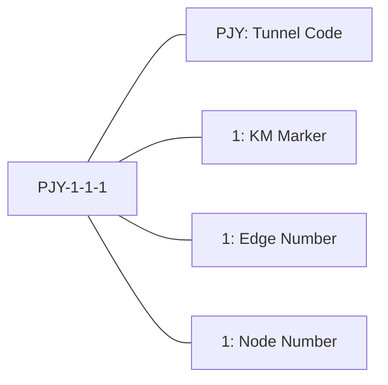
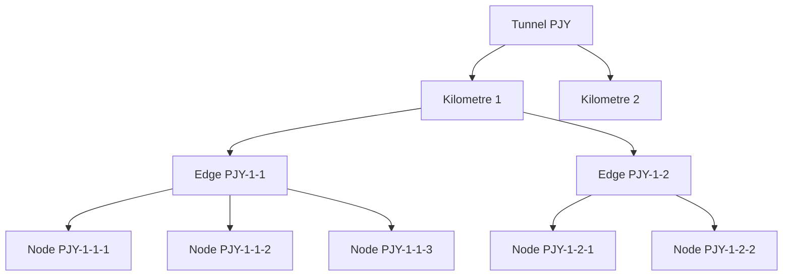
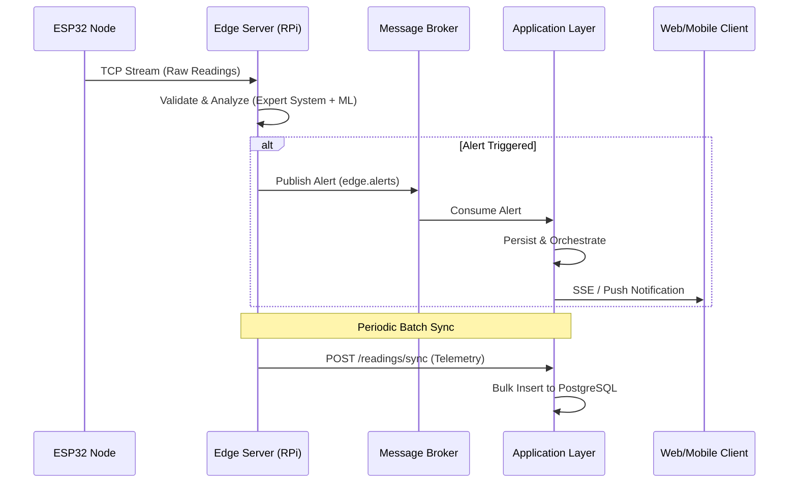
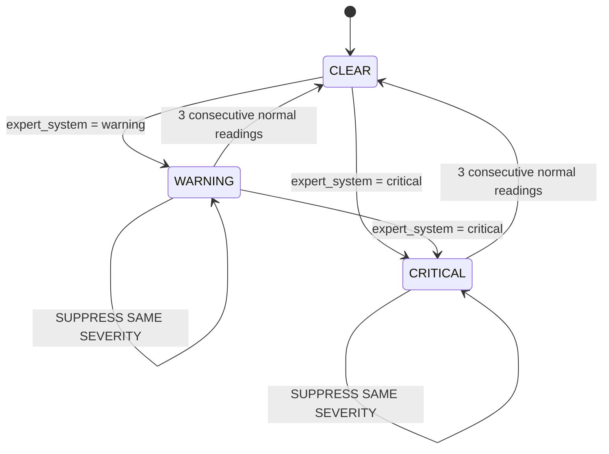

# DeepAtmos — System Architecture

**Real-Time Tunnel Atmospheric Hazard Detection and Alert Framework**

> This is the single authoritative architecture reference for the entire DeepAtmos system. It covers all five layers end-to-end: Node Layer (ESP32), Edge Layer (Raspberry Pi 5), Application Layer (FastAPI cloud), Frontend Web (React), and Frontend Mobile (Flutter).

---

## Table of Contents

1. [System Overview](#1-system-overview)
2. [Device ID Convention](#2-device-id-convention)
3. [Communication Model](#3-communication-model)
4. [Node Layer — ESP32](#4-node-layer--esp32)
5. [Edge Layer — Raspberry Pi 5](#5-edge-layer--raspberry-pi-5)
6. [ML Model — GRU Predictive Detection](#6-ml-model--gru-predictive-detection)
7. [Application Layer — FastAPI Cloud](#7-application-layer--fastapi-cloud)
8. [Frontend Web — React SPA](#8-frontend-web--react-spa)
9. [Frontend Mobile — Flutter](#9-frontend-mobile--flutter)
10. [Data Schemas — Cross-Layer](#10-data-schemas--cross-layer)
11. [Field Naming Convention](#11-field-naming-convention)
12. [Colour & Theme System](#12-colour--theme-system)

---

## 1. System Overview

DeepAtmos is a five-layer distributed IoT system that monitors atmospheric conditions inside tunnels in real time, detects hazards using both reactive rule-based and predictive machine learning methods, and delivers alerts to safety personnel through a web dashboard and a mobile pager app.

```mermaid
graph TD
    subgraph "Operational Layer (Outside Tunnel)"
        Web["Frontend Web (React)"]
        Mobile["Frontend Mobile (Flutter)"]
    end

    subgraph "Application Layer (Central Cloud)"
        FastAPI["API Gateway (FastAPI)"]
        DB[(PostgreSQL)]
        Kafka{Apache Kafka}
    end

    subgraph "Edge Layer (Inside Tunnel)"
        RPi1["Edge Server 1 (RPi 5)"]
        RPi2["Edge Server n... (RPi 5)"]
        SQLite[(Local SQLite Buffer)]
    end

    subgraph "Node Layer (In-Situ)"
        direction LR
        ESP1["Node 1 (ESP32)"]
        ESP2["Node 2 (ESP32)"]
        ESP3["Node n... (ESP32)"]
    end

    %% Communication Flows
    ESP1 -- "TCP/TLS" --> RPi1
    ESP2 -- "TCP/TLS" --> RPi1
    ESP3 -- "TCP/TLS" --> RPi2

    %% Local Buffering
    RPi1 -.-> SQLite
    RPi2 -.-> SQLite

    RPi1 -- "HTTP Batch Sync" --> FastAPI
    RPi2 -- "HTTP Batch Sync" --> FastAPI

    RPi1 -- "Alert Publish" --> Kafka
    RPi2 -- "Alert Publish" --> Kafka

    %% Application Layer Persistence
    Kafka -- "Consumption" --> FastAPI
    FastAPI -.-> "ORM Persistence" -.-> DB

    %% User Facing
    FastAPI -- "SSE Alerts" --> Web
    FastAPI -- "FCM Push" --> Mobile
    Web -- "Auth/Config (REST)" --> FastAPI
```

### Layer Responsibilities

| Layer           | Component                    | Responsibility                                                                                                   |
| --------------- | ---------------------------- | ---------------------------------------------------------------------------------------------------------------- |
| Node            | ESP32                        | Sensor data collection, actuator control (traffic light, buzzer, buttons)                                        |
| Edge            | Raspberry Pi 5               | Ingestion, local storage, Expert System, GRU inference, alert suppression, Kafka publish, cloud sync, heartbeats |
| Application     | FastAPI + PostgreSQL + Kafka | Cloud backend — auth, user management, readings storage, alert lifecycle, SSE, FCM, audit, heartbeats            |
| Frontend Web    | React SPA                    | Primary operational + admin interface for all roles                                                              |
| Frontend Mobile | Flutter app                  | Lightweight pager — FCM alerts, alert feed, alert summary                                                        |

---

## 2. Device ID Convention

Every node in the system has a structured ID encoding its physical location:



**Example:** `PJY-1-1-1` = Putrajaya Line, Kilometre 1, Edge 1, Node 1.

**Hierarchy:**



```
Tunnel (PJY)
└── Kilometre 1
    └── Edge PJY-1-1 (Raspberry Pi 5, covers ~250m)
        ├── Node PJY-1-1-1
        ├── Node PJY-1-1-2
        ├── Node PJY-1-1-3
        └── Node PJY-1-1-4
```

Scale: each 1 km tunnel segment supports up to 4 edges and 20 nodes.

---

## 3. Communication Model

| Sensor readings | Node → Edge | TCP + TLS (persistent connection) | Every reading cycle |
| Actuator commands | Edge → Node | TCP (same connection) | Immediate on alert |
| Readings sync | Edge → App | HTTP/S batch `POST /readings/sync` | Every 300 seconds |
| Edge heartbeat | Edge → App | HTTP/S `POST /system/edges/heartbeat` | Every 300 seconds |
| Alerts | Edge → App | Kafka `edge.alerts` topic | Immediate on trigger |
| Readings to web | App → Web | HTTPS polling | Every 300 seconds |
| Alerts to web | App → Web | SSE `/incidents/stream` | Immediate on Kafka receipt |
| Alerts to mobile | App → Mobile | FCM push notification | Immediate on Kafka receipt |
| Mobile session | Mobile → App | HTTPS (any API call) | On app usage — updates `last_active_at` |

---

## 4. Node Layer — ESP32

### Tech Stack

| Component     | Technology                                                           |
| ------------- | -------------------------------------------------------------------- |
| Firmware      | Arduino IDE, C++                                                     |
| Network       | WiFiClientSecure (mTLS)                                              |
| Serialisation | ArduinoJson                                                          |
| Sensors       | DHT22 (temp/humidity), MQ-135/7/4 (CO₂/CO/CH₄), PMS5003 (PM2.5/PM10) |
| Actuators     | Traffic Light LED array, Buzzer, Physical buttons                    |

### Device Authentication

Each ESP32 authenticates with a per-device `auth_token` included in every JSON payload. The Edge validates on receipt — unknown or mismatched tokens are rejected and logged. There are no client TLS certificates; the ESP32 validates the Edge's server certificate using the shared CA cert.

### Payload Sent to Edge

```json
{
  "id": "PJY-1-1-1",
  "auth_token": "uhfawu93efo",
  "temperature": 25.0,
  "humidity": 50.0,
  "carbon_dioxide": 400.0,
  "carbon_monoxide": 2.1,
  "methane": 1.8,
  "oxygen": 21.0,
  "pm2_5": 10.0,
  "pm10": 10.0,
  "aqi": 10
}
```

### Actuator Command Received from Edge

```json
{
  "id": "PJY-1-1-1",
  "severity": "critical",
  "actuator": {
    "traffic_light": "red",
    "buzzer": true
  }
}
```

`traffic_light` values: `"green"` (normal/boot default), `"yellow"` (warning), `"red"` (critical)

---

## 5. Edge Layer — Raspberry Pi 5

### Tech Stack

| Component       | Technology                              |
| --------------- | --------------------------------------- |
| Framework       | FastAPI + Uvicorn                       |
| Database        | SQLite (local, async SQLAlchemy)        |
| Schema          | Pydantic v2                             |
| ML Inference    | TensorFlow Lite (`tflite-runtime`)      |
| Alert Transport | Apache Kafka — Aiven Managed            |
| Readings Sync   | HTTP/S → Application Layer              |
| Auth (service)  | `X-API-Key` header — one key per tunnel |
| Package manager | `uv`                                    |
| Dev simulator   | Python TCP clients in `sim/`            |

### Event Processing Pipeline



### Alert Suppression State Machine

Per-node in-memory state prevents alert flooding during sustained events.



Result: a full degradation → escalation → recovery event produces exactly **2 alerts** regardless of duration.

---

## 6. ML Model — GRU Predictive Detection

### Design: Predictive, not Reactive

The GRU model predicts **next-cycle severity** from the last 60 readings, firing before the Expert System threshold is crossed. This is the primary ML novelty of DeepAtmos.

```
Expert System (reactive):   CO₂ = 2100 ppm → alert NOW
GRU (predictive):           CO₂ trending +150ppm/cycle for 8 cycles → alert INCOMING
```

Both run in parallel. If both fire on the same reading: highest severity wins, one alert published. `expert_system` takes precedence on equal severity.

### Model

```
Input: (60, 9)  — 10 timesteps × 9 sensor features
        ↓
GRU(64, return_sequences=False)
        ↓
Dropout(0.2)
        ↓
Dense(32, ReLU)
        ↓
Dense(3, Softmax)  →  [P(normal), P(warning), P(critical)]
```

- Loss: Sparse Categorical Crossentropy | Optimiser: Adam lr=0.001
- Confidence threshold: 0.6 (suppress low-confidence predictions)
- Labels: derived from Expert System thresholds applied to `t+1` reading

### Training

| Item              | Detail                                                                                     |
| ----------------- | ------------------------------------------------------------------------------------------ |
| Machine           | MacBook Air M3, 16GB RAM                                                                   |
| Framework         | TensorFlow 2.x (`tensorflow-macos` + `tensorflow-metal`)                                   |
| Dataset           | 55,000 synthetic labeled sequences (7 tunnel degradation scenarios)                        |
| Output            | `gru_model.tflite` (float16 quantised, ~200KB), `scaler.json`, `confidence_threshold.json` |
| Deployment        | `scp` artifacts to Pi → loaded at startup via `tflite-runtime`                             |
| Inference latency | < 10ms per reading on Pi 5                                                                 |

### GRU Cold Start

Buffer fills after 60 readings (~5 minutes). Expert System provides sole coverage during this window — no gap in alert protection.

---

## 7. Application Layer — FastAPI Cloud

### Tech Stack

| Component       | Technology                             |
| --------------- | -------------------------------------- |
| Framework       | FastAPI                                |
| Hosting         | Render (Singapore)                     |
| Database        | PostgreSQL — Aiven Managed             |
| Alert Ingestion | Apache Kafka — Aiven Managed           |
| ORM             | SQLAlchemy (async) + asyncpg           |
| Migrations      | Alembic                                |
| Validation      | Pydantic v2                            |
| Auth            | JWT (web) + QR session tokens (mobile) |
| Push            | firebase-admin (FCM)                   |
| API Docs        | Disabled in production                 |

### Authentication

#### Web — JWT

| Token         | Lifespan   | Storage              |
| ------------- | ---------- | -------------------- |
| Access Token  | 15 minutes | Zustand memory (web) |
| Refresh Token | 7 days     | `httpOnly` cookie    |

- Refresh token rotation enforced on every use
- Refresh tokens tied to user-agent fingerprint for per-device revocation
- No self-registration, no self-service password reset

#### Mobile — QR Session

| Field                  | Value                                                                        |
| ---------------------- | ---------------------------------------------------------------------------- |
| Session token lifespan | 30 days from last activity                                                   |
| Activity tracking      | Any authenticated mobile API request updates `last_active_at` via middleware |
| Devices per account    | 1 — new pair revokes previous session                                        |
| Revocation             | By user (unpair), Admin, or on account deletion                              |

`mobile_sessions` table:

```json
{
  "id": "uuid",
  "user_id": "uuid",
  "session_token": "opaque-random-token",
  "fcm_token": "fcm-registration-token",
  "user_agent": "DeepAtmos Flutter/Android 14",
  "created_at": "...",
  "last_active_at": "...",
  "revoked": false
}
```

### Roles & Permissions

| Role         | Users     | Tunnels/Edges/Nodes | Readings | Alerts               | Reports   | Audit | System |
| ------------ | --------- | ------------------- | -------- | -------------------- | --------- | ----- | ------ |
| Master Admin | ✅ All    | ✅ All              | ✅       | ✅ Full              | ✅        | ✅    | ✅     |
| Admin        | ✅ Scoped | ✅ Scoped           | ✅       | ✅ Full              | ✅        | ❌    | ✅     |
| Technician   | ❌        | ✅ Manage (scoped)  | ✅       | ✅ Ack+Resolve+Notes | ✅        | ❌    | ✅     |
| Associate    | ❌        | ❌ View only        | ✅       | ✅ Ack+Resolve+Notes | ✅ (read) | ❌    | ❌     |
| Viewer       | ❌        | ❌ View only        | ✅       | ✅ View only         | ✅ (read) | ❌    | ❌     |

> **Scoped** — assigned to tunnels via `user_tunnel_assignments`. All scoped roles operate only within assigned tunnels.

### JWT Payload (Web)

```json
{
  "sub": "user_id",
  "role": "technician",
  "tunnel_codes": ["PJY"],
  "iat": 1740268800,
  "exp": 1740269700
}
```

### Core Services (all under `/api/v1/`)

#### 1. Auth Service

| Method   | Endpoint                     | Description                                 |
| -------- | ---------------------------- | ------------------------------------------- |
| `POST`   | `/auth/login`                | Web login → access + refresh token          |
| `POST`   | `/auth/refresh`              | Rotate refresh token                        |
| `POST`   | `/auth/logout`               | Revoke current session                      |
| `POST`   | `/auth/logout/all`           | Revoke all sessions                         |
| `POST`   | `/auth/mobile-qr`            | Generate 5-min single-use QR token          |
| `POST`   | `/auth/mobile-verify`        | Mobile exchanges QR token for session token |
| `GET`    | `/auth/mobile-sessions`      | List active mobile sessions                 |
| `DELETE` | `/auth/mobile-sessions/{id}` | Revoke mobile session                       |

#### 2. User Management

| Method             | Endpoint              | Min Role     |
| ------------------ | --------------------- | ------------ |
| `GET/POST`         | `/users`              | Admin        |
| `GET/PATCH/DELETE` | `/users/{id}`         | Admin        |
| `PATCH`            | `/users/{id}/role`    | Master Admin |
| `PATCH`            | `/users/{id}/suspend` | Admin        |
| `POST/DELETE`      | `/users/{id}/tunnels` | Admin        |

#### 3. Tunnel Management

| Method             | Endpoint                 | Min Role       |
| ------------------ | ------------------------ | -------------- |
| `GET/POST`         | `/tunnels`               | Viewer / Admin |
| `GET/PATCH/DELETE` | `/tunnels/{code}`        | Viewer / Admin |
| `GET`              | `/tunnels/{code}/status` | Viewer         |

#### 4. Edge Management

| Method             | Endpoint                                | Min Role   |
| ------------------ | --------------------------------------- | ---------- |
| `GET/POST`         | `/tunnels/{code}/edges`                 | Technician |
| `GET/PATCH/DELETE` | `/tunnels/{code}/edges/{km}/{num}`      | Technician |
| `GET/PATCH`        | `/tunnels/{code}/edges/{km}/{num}/wifi` | Admin      |

#### 5. Node Management

| Method             | Endpoint              | Min Role            |
| ------------------ | --------------------- | ------------------- |
| `GET/POST`         | `/nodes`              | Viewer / Technician |
| `GET/PATCH/DELETE` | `/nodes/{id}`         | Viewer / Technician |
| `PATCH`            | `/nodes/{id}/enable`  | Technician          |
| `PATCH`            | `/nodes/{id}/disable` | Technician          |

#### 6. Readings Service

| Method | Endpoint              | Description                                                      |
| ------ | --------------------- | ---------------------------------------------------------------- |
| `GET`  | `/readings`           | Query (filterable by node, tunnel, km, time, metric, resolution) |
| `GET`  | `/readings/{node_id}` | Node-specific readings                                           |
| `POST` | `/readings/sync`      | Ingest batch from Edge (Internal, X-API-Key)                     |

#### 7. Alert Service

Alert lifecycle: `Active → Acknowledged → Resolved → (Reopened → ...)`

| Method  | Endpoint                   | Min Role     |
| ------- | -------------------------- | ------------ |
| `GET`   | `/alerts`                  | Viewer       |
| `GET`   | `/alerts/{id}`             | Viewer       |
| `GET`   | `/alerts/stream`           | Viewer (SSE) |
| `PATCH` | `/alerts/{id}/acknowledge` | Associate    |
| `PATCH` | `/alerts/{id}/resolve`     | Associate    |
| `PATCH` | `/alerts/{id}/reopen`      | Associate    |
| `POST`  | `/alerts/{id}/notes`       | Associate    |

**Kafka Consumer behaviour:**
On message receipt from `edge.alerts` → persist to PostgreSQL → generate `alert.summary` → push SSE to web clients → dispatch FCM to mobile users

#### 8. Notification Service

| Method      | Endpoint                     | Description                               |
| ----------- | ---------------------------- | ----------------------------------------- |
| `POST`      | `/notifications/fcm-refresh` | Update FCM token (mobile on every launch) |
| `GET/PATCH` | `/notifications/preferences` | Severity threshold preference             |

#### 9. Audit Log

| Method | Endpoint | Min Role |
| ------ | -------- | -------- |
| `GET`  | `/audit` | Admin    |

Tracked actions: user login/logout, user CRUD, role changes, tunnel/edge/node CRUD, alert lifecycle, WiFi config changes, mobile device paired/revoked.

#### 10. System Health

| Method | Endpoint                     | Min Role               |
| ------ | ---------------------------- | ---------------------- |
| `GET`  | `/system/status`             | Technician             |
| `GET`  | `/system/edges/connectivity` | Technician             |
| `POST` | `/system/edges/heartbeat`    | Internal (sync worker) |
| `GET`  | `/system/overview`           | Viewer (aggregate)     |

Offline detection: edge not synced within 600s → marked `offline`.

### PostgreSQL Schema Notes

- `readings`: indexed on `(node_id, timestamp)` for time-series queries
- `alerts.trigger_reading`: must be `JSONB` (not `text`) — migration required if agent created as text
- `alerts.technician_notes`: `JSONB` array of `{user_id, timestamp, note}`
- `alerts.unsynced_readings_snapshot`: `JSONB`
- `nodes.capabilities`: `JSONB`
- `alerts.summary`: server-generated plain-English sentence on alert creation

---

## 8. Frontend Web — React SPA

### Tech Stack

| Component    | Technology                                                           |
| ------------ | -------------------------------------------------------------------- |
| Framework    | React 19 + TypeScript                                                |
| Build        | Vite 7                                                               |
| Routing      | React Router 7 (`createBrowserRouter`)                               |
| Server State | TanStack Query (300s polling)                                        |
| Local State  | Zustand (`authStore`, `tunnelStore`, `systemStore`)                  |
| HTTP         | Axios (interceptors: auth injection, 401 refresh, offline detection) |
| Realtime     | SSE via `SSEProvider` context (`/incidents/stream`)                  |
| UI           | Shadcn/ui (Radix UI primitives)                                      |
| Styling      | Tailwind CSS v4                                                      |
| Charts       | Recharts                                                             |
| Map          | MapLibre GL (`CoordinateMapPicker`, `TunnelMapView`)                 |
| Data         | TanStack Query + SSE (`SSEProvider`)                                 |
| Hosting      | Render Static Site                                                   |

### App Composition

- `SSEProvider` — manages EventSource, exponential backoff reconnect, batched incident updates, toast dedup/cooldown
- `ServiceOffline` overlay — shown when `systemStore` detects API failure
- `LazyRoute` — all page components lazy-loaded via `React.lazy()`
- `ProtectedRoute` — auth + role + tunnel scope guards on every authenticated route

### Session Strategy

- Access token: Zustand memory (never localStorage)
- Refresh token: `httpOnly` cookie (`withCredentials: true`)
- Bootstrap refresh on app startup restores session from cookie
- Axios intercepts 401 → queues parallel requests → refreshes → retries

### Route Map

| Route                     | Access       | Component                                                        |
| ------------------------- | ------------ | ---------------------------------------------------------------- |
| `/login`                  | Public       | `Login.tsx`                                                      |
| `/dashboard`              | Viewer+      | `Dashboard.tsx` (4 tabs: Overview, Incidents, Topology, Spatial) |
| `/monitoring`             | Viewer+      | `LiveMonitoring.tsx`                                             |
| `/monitoring/:node_id`    | Viewer+      | `LiveMonitoring.tsx` (pre-filtered)                              |
| `/incidents/:id`          | Viewer+      | `IncidentDetail.tsx`                                             |
| `/nodes`                  | Viewer+      | `NodeVisualisation.tsx`                                          |
| `/topology`               | Technician+  | `NetworkTopology.tsx`                                            |
| `/admin/infrastructure`   | Technician+  | `ManageInfrastructure.tsx`                                       |
| `/admin/users`            | Admin+       | `ManageUsers.tsx`                                                |
| `/admin/audit`            | Master Admin | `ActivityLog.tsx`                                                |
| `/system/status`          | Technician+  | `SystemStatus.tsx`                                               |
| `/settings/notifications` | Viewer+      | `Notifications.tsx`                                              |
| `/settings/mobile`        | Associate+   | `MobileDevices.tsx`                                              |
| `/profile`                | All          | `Profile.tsx`                                                    |

> `/incidents` redirects to `/dashboard?tab=incidents` — the incidents list is a dashboard tab, not a standalone page.

### Dashboard Tabs

| Tab       | Component               | Content                                                                 |
| --------- | ----------------------- | ----------------------------------------------------------------------- |
| Overview  | `DashboardOverviewTab`  | Summary cards: tunnel status, active incidents, online nodes, last sync |
| Incidents | `DashboardIncidentsTab` | Live incident list with SSE prepend, critical pinned                    |
| Topology  | `DashboardTopologyTab`  | Embedded network topology                                               |
| Spatial   | `DashboardSpatialView`  | MapLibre map with node markers                                          |

### Theme

Black and White — black sidebar (`#111827`), white background (`#FFFFFF`). RGY reserved exclusively for severity indicators.

| Severity | Background | Text      |
| -------- | ---------- | --------- |
| Critical | `#FEF2F2`  | `#DC2626` |
| Warning  | `#FFFBEB`  | `#D97706` |
| Normal   | `#F0FDF4`  | `#16A34A` |
| Offline  | `#F9FAFB`  | `#6B7280` |

### Zustand Stores

| Store         | Persisted As     | Contents                                                            |
| ------------- | ---------------- | ------------------------------------------------------------------- |
| `authStore`   | `deepatmos-auth` | `accessToken`, `userId`, `role`, `tunnelCodes`, `fullName`, `email` |
| `tunnelStore` | `tunnel-storage` | `activeTunnelCode`                                                  |
| `systemStore` | (not persisted)  | API connectivity / offline state                                    |

---

## 9. Frontend Mobile — Flutter

### Tech Stack

| Component        | Technology                    |
| ---------------- | ----------------------------- |
| Framework        | Flutter (stable, Dart)        |
| Navigation       | `go_router`                   |
| HTTP             | `dio`                         |
| Push             | `firebase_messaging` (FCM)    |
| Storage          | `flutter_secure_storage`      |
| State            | `riverpod`                    |
| QR Scanner       | `mobile_scanner`              |
| External Browser | `url_launcher`                |
| Notifications    | `flutter_local_notifications` |
| Build            | Standard `flutter build apk`  |

### Three Screens

```
QR Scan  ──►  Alert Feed  ──►  Alert Summary
                 ▲
                 │ (FCM tap deep link)
```

| Screen        | Route            | Description                                                                                                           |
| ------------- | ---------------- | --------------------------------------------------------------------------------------------------------------------- |
| QR Scan       | `/qr-scan`       | Shown when no session. Camera opens immediately. Scans `qr_token` → POST `/auth/mobile-verify` → stores session_token |
| Alert Feed    | `/` (index)      | Last 50 alerts, critical pinned, pull-to-refresh. `[•••]` → unpair                                                    |
| Alert Summary | `/incidents/:id` | 9-metric reading summary with ⚠️ flags. "Open Full Alert in Web ↗" button                                             |

### FCM Handlers

```dart
// Foreground
FirebaseMessaging.onMessage.listen(showAlertBanner);

// Background tap
FirebaseMessaging.onMessageOpenedApp.listen((msg) => router.go('/incidents/${msg.data["alert_id"]}'));

// Killed app tap
final initial = await FirebaseMessaging.instance.getInitialMessage();
if (initial != null) router.go('/incidents/${initial.data["alert_id"]}');
```

### Session

- Stored in `flutter_secure_storage` (AES on Android, Keychain on iOS)
- 30-day inactivity expiry — any API call resets the clock server-side
- On 401: clears storage → `router.go('/qr-scan')`
- FCM token synced on every launch + `onTokenRefresh` via `POST /notifications/fcm-refresh`

### Theme

Matches web exactly — black AppBar (`#111827`), white background, same severity colour palette.

| Flutter Widget      | Colour              |
| ------------------- | ------------------- |
| `AppBar`            | `Color(0xFF111827)` |
| Scaffold background | `Colors.white`      |
| Card surface        | `Color(0xFFF9FAFB)` |
| Text primary        | `Color(0xFF111827)` |
| Text muted          | `Color(0xFF6B7280)` |

---

## 10. Data Schemas — Cross-Layer

### Field Naming Convention

```
ESP32 sends        "id"       ← firmware convention
        ↓ renamed once at ingestion
Edge internal      "node_id"  ← consistent from here
Sync batch         "node_id"
Kafka payload      "node_id"
App Layer DB       "node_id"
        ↓ actuator command back
ESP32 receives     "id"       ← firmware expects this
```

### Sensor Fields (all layers consistent)

`temperature`, `humidity`, `carbon_dioxide`, `carbon_monoxide`, `methane`, `oxygen`, `pm2_5`, `pm10`, `aqi`

### Reading Schema (PostgreSQL)

```json
{
  "id": "uuid",
  "node_id": "PJY-1-1-1",
  "timestamp": "2026-02-23T12:05:59+08:00",
  "temperature": 25.0,
  "humidity": 50.0,
  "carbon_dioxide": 400.0,
  "carbon_monoxide": 2.1,
  "methane": 1.8,
  "oxygen": 21.0,
  "pm2_5": 10.0,
  "pm10": 10.0,
  "aqi": 10
}
```

### Alert Schema (PostgreSQL)

```json
{
    "id": "uuid",
    "node_id": "PJY-1-1-1",
    "timestamp": "2026-02-23T12:05:59+08:00",
    "severity": "critical",
    "status": "acknowledged",
    "summary": "CO₂ threshold exceeded at PJY-1-1-1.",
    "trigger_source": "expert_system",
    "trigger_reading": { ...9 sensor fields... },
    "acknowledged_by": "uuid",
    "acknowledged_at": "2026-02-23T12:07:00+08:00",
    "resolved_by": null,
    "resolved_at": null,
    "resolution_notes": null,
    "technician_notes": [],
    "unsynced_readings_snapshot": []
}
```

`status` values: `active`, `acknowledged`, `resolved`, `reopened`
`trigger_source` values: `expert_system`, `gru_model`
`trigger_reading`, `technician_notes`, `unsynced_readings_snapshot`, `capabilities` → must be `JSONB`

### Node Schema (PostgreSQL)

```json
{
    "id": "PJY-1-1-1",
    "tunnel_code": "PJY",
    "kilometre": 1,
    "edge_id": "PJY-1-1",
    "edge_number": 1,
    "node_number": 1,
    "location_description": "Km1 Edge1 Node1 — CO₂ sensor cluster",
    "latitude": 2.9285,
    "longitude": 101.6975,
    "capabilities": { "has_dht22": true, "has_mq_array": true, ... },
    "enabled": true,
    "last_seen": "2026-02-23T12:05:59+08:00",
    "status": "normal"
}
```

`status` values: `normal`, `warning`, `critical`, `offline`, `disabled`

---

## 11. Field Naming Convention

| Context                 | Field name                      | Notes                                   |
| ----------------------- | ------------------------------- | --------------------------------------- |
| ESP32 → Edge (inbound)  | `"id"`                          | Firmware sends short name               |
| Edge internal (SQLite)  | `"node_id"`                     | Renamed at ingestion                    |
| Edge → App (sync batch) | `"node_id"`                     | `cloud_sync` stripped                   |
| Edge → Kafka            | `"node_id"`                     | + `tunnel_code` added explicitly        |
| Edge → ESP32 (actuator) | `"id"`                          | Back to firmware convention             |
| App Layer DB            | `"node_id"`                     | Single consistent name                  |
| Frontend Web            | `incident` (UI) / `alert` (API) | UI uses "incident"; DB/API uses "alert" |

---

## 12. Colour & Theme System

Both frontends share the same palette — no divergence between web and mobile.

### Base Palette

| Role            | Hex       | Usage                      |
| --------------- | --------- | -------------------------- |
| Background      | `#FFFFFF` | Page / scaffold background |
| Surface         | `#F9FAFB` | Cards, list items          |
| Surface Variant | `#F3F4F6` | Dividers, input fills      |
| Accent / Header | `#111827` | Sidebar, AppBar, buttons   |
| Text Primary    | `#111827` | Body text, headings        |
| Text Muted      | `#6B7280` | Timestamps, labels         |
| Border          | `#E5E7EB` | Card borders, dividers     |

### Severity Palette (exclusive use — no other UI elements)

| Severity              | Background | Text/Icon |
| --------------------- | ---------- | --------- |
| Critical              | `#FEF2F2`  | `#DC2626` |
| Warning               | `#FFFBEB`  | `#D97706` |
| Normal / Acknowledged | `#F0FDF4`  | `#16A34A` |
| Offline / Disabled    | `#F9FAFB`  | `#6B7280` |
