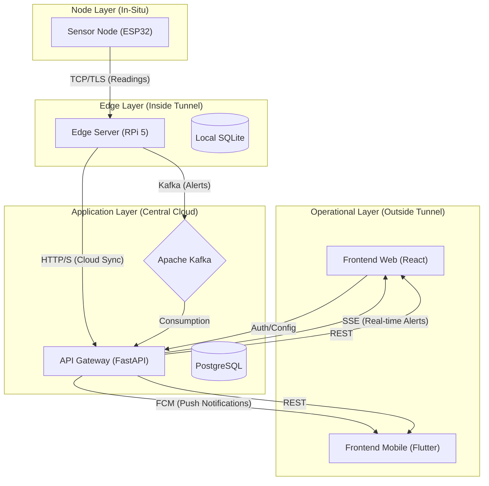
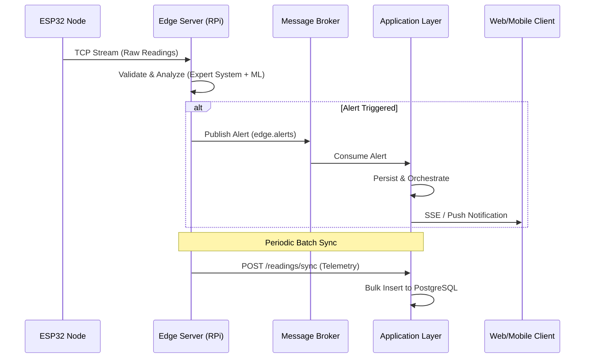
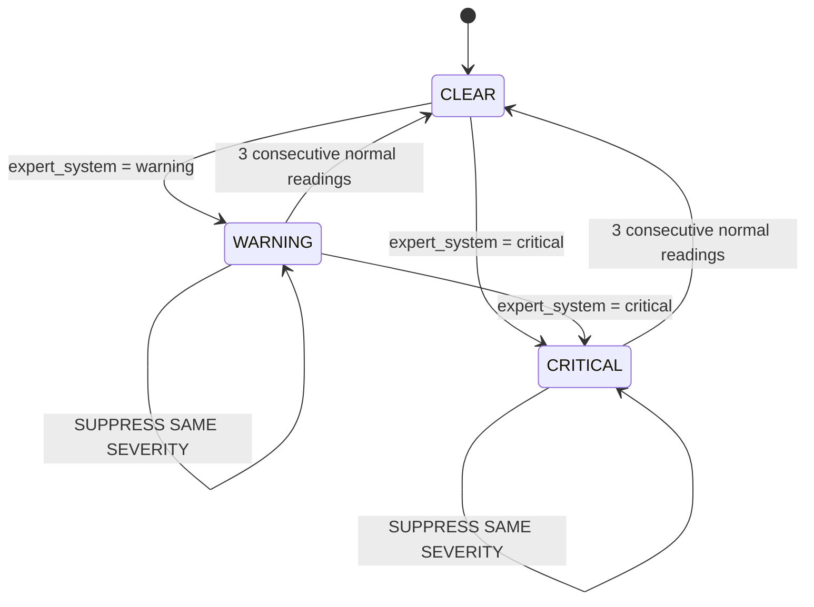

# DeepAtmos: Structural Snapshot (Academic Review)

This folder contains a **NON-FUNCTIONAL, STRUCTURAL SNAPSHOT** of the DeepAtmos system for academic submission and review purposes. It provides a comprehensive, structural overview of the framework, aggregating system design, module relationships, and key logic flows across all layers of the distributed stack.

---

## 1. Executive Summary

DeepAtmos is a five-layer IoT framework for real-time atmospheric hazard detection in tunnel environments. It combines high-frequency sensor ingestion with reactive and predictive analysis to protect infrastructure and personnel.

## 2. Important Notice

- This snapshot is **NOT intended to run**.
- Full implementation details, sensitive processing logic, and mathematical models have been **REDACTED**.
- All secrets, API keys, and deployment configurations have been **REMOVED**.
- This snapshot is provided to demonstrate the **system architecture**, **module relationships**, and **core logic flow**.

---

## 3. System Architecture

### 3.1 System Context Diagram
The following diagram illustrates the interaction between the distributed Edge nodes, the central Cloud Application, and the various operational frontends.



### 3.2 Data Lifecycle & Ingestion Flow
This diagram traces a sensor measurement from the physical environment to the operator's screen.



---

## 4. Core Logic & Module Structure

### 4.1 Edge Layer: Logic Flow
The Edge Layer focuses on low-latency ingestion and autonomous alerting.

#### 4.1.1 TCP Ingestion Logic
Redacted signature of the asynchronous ingestion server:
```python
class EdgeTCPServer:
    """Asynchronous TCP server for sensor data ingestion."""
    async def handle_client(self, reader, writer):
        """
        - Read JSON payloads from stream
        - [REDACTED: sensitive auth and decryption logic]
        - Validate device identity and metadata
        - Pass payload to Processing Engine
        """
        pass
```

#### 4.1.2 Alert Suppression FSM
To prevent alert flooding, the Edge layer implements an in-memory state machine.


---

## 5. Application Layer: API & Orchestration
The Application Layer manages the long-term state and identity of the system.

### 5.1 Real-Time Alert Distribution
The `KafkaConsumerService` and `SSEManager` work together to provide sub-second latency for hazard notifications.

```python
class KafkaConsumerService:
    """Processes inbound alerts from distributed Edge nodes."""
    async def _consume_loop(self, alert_callback):
        """
        1. Connect to Aiven Kafka with SSL
        2. Stream messages from 'edge.alerts'
        3. Trigger broadcast to SSE and FCM services
        """
        pass

class SSEManager:
    """Manages long-lived client connections for live dashboard updates."""
    async def broadcast(self, event_data: dict):
        """
        - Serialize alert payload
        - Fan-out to all active WebSocket-alternative (SSE) queues
        - [REDACTED: connection cleanup logic]
        """
        pass
```

### 5.2 Security & RBAC
Access is managed via JWT for web and session-based tokens for mobile, with strict tunnel-scoping (multi-tenancy). Roles include:
- **Master Admin / Admin**: Global or scoped system management.
- **Technician**: Infrastructure maintenance and incident resolution.
- **Associate / Viewer**: Operational monitoring and reporting.

---

## 6. Data Models (Abstracted)

The following schemas define the core entities within the DeepAtmos ecosystem.

### 6.1 Tunnel
Represents a monitored geographical infrastructure unit.
- **code**: Unique identifier (e.g., PJY).
- **polyline**: Geospatial path for map visualization.
- **active**: Deployment status.

### 6.2 Node
Individual ESP32 sensor units located at specific markers.
- **id**: Structured ID (Tunnel-KM-Edge-Node).
- **capabilities**: JSON-encoded sensor flags (DHT22, MQ-Array, etc.).
- **location**: Latitude/Longitude coordinates.

### 6.3 Reading
High-frequency telemetry data stored in the cloud.
- **node_id**: Source node.
- **timestamp**: UTC sampling time.
- **metrics**: 9-axis sensor array (CO2, CO, CH4, O2, PM2.5, PM10, Temp, Humidity, AQI).

### 6.4 Alert
Immutable record of a detected environmental hazard.
- **severity**: Warning or Critical.
- **trigger_source**: Expert System or ML (GRU) Model.
- **trigger_reading**: Snapshot of the data point that fired the alert.

---

## 7. Frontend Architecture

### 7.1 Web (React 19)
- **State Management**: Zustand for global auth and tunnel context.
- **Data Ingestion**: TanStack Query (Polling) + SSE (Real-time).
- **Visualization**: MapLibre GL for geospatial node tracking.

### 7.2 Mobile (Flutter)
- **State Management**: Riverpod for reactive UI updates.
- **Notification**: Firebase Cloud Messaging (FCM) for background alerting.
- **Pairing**: Secure QR-code handshake for device association.

---

## 8. Snapshot Structure

- `application/`: Backend architecture (FastAPI, Models, Routes, Services).
- `edge/`: Hardware layer (TCP Server, Core Logic).
- `frontend-web/`: Web interface components.
- `frontend-mobile/`: Mobile application structure.

---

## 9. Redaction Format

Internal logic has been replaced with comments like:
`# [REDACTED: sensitive processing logic]`
`// [REDACTED: sensitive processing logic]`

The full, functional system is available for review under controlled environments and with proper authorization.

---

> [!NOTE]
> This document remains non-functional and is intended for structural review and academic submission. All sensitive logic and internal configurations have been redacted as per project security requirements.
